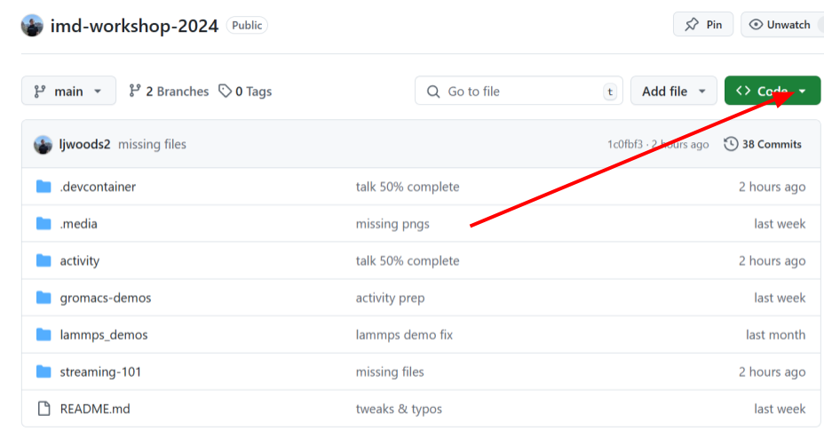
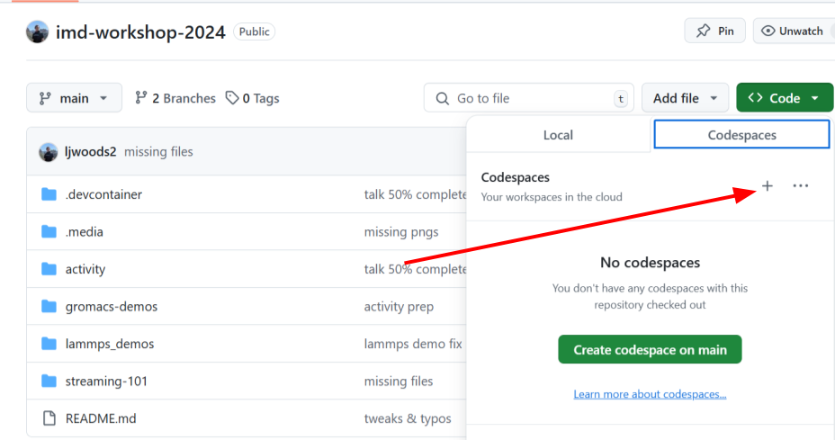
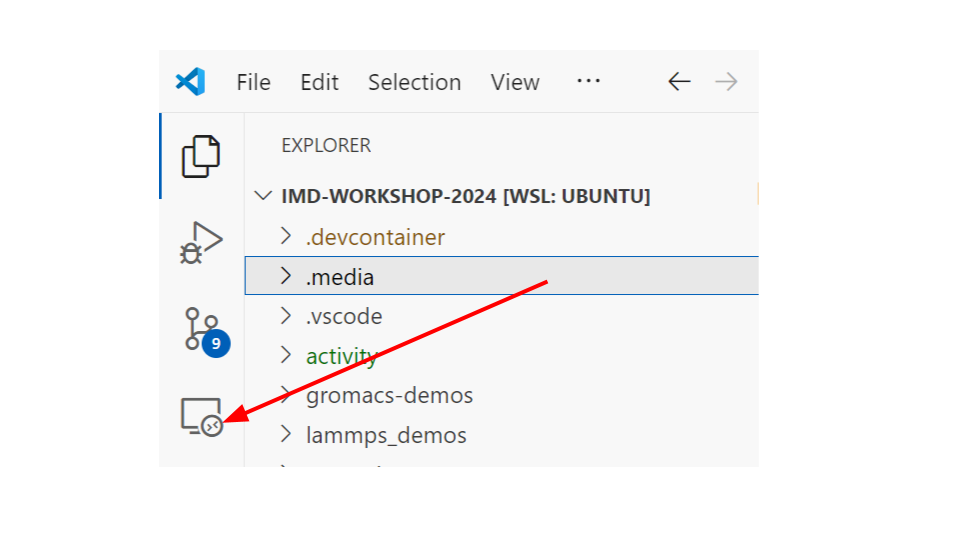
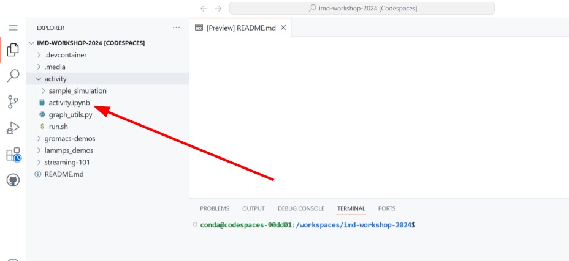
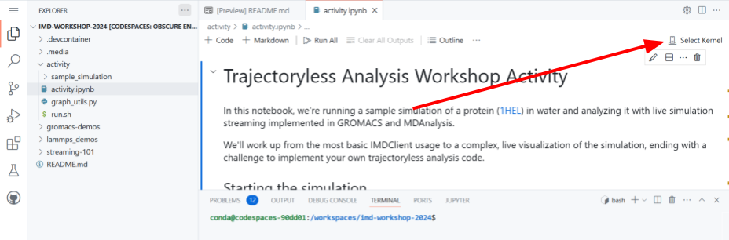
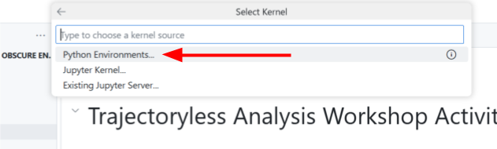
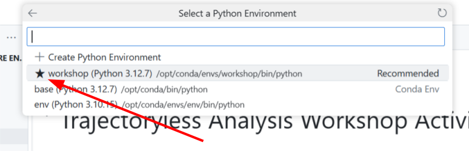

Welcome to the MDAnalysis 2024 trajectory streaming workshop! 
For the interactive activity, see [interactive activity](#interactive-activity).
If you're interested in using our tools after the workshop and watching a recording, see [post workshop](#post-workshop)

##### Table of Contents  

- [Workshop agenda](#workshop-agenda)
- [Interactive activity](#interactive-activity)
  - [1. Codespace environment setup](#1-codespace-environment-setup)
    - [i. Github codespaces in the browser (recommended)](#i-github-codespaces-in-the-browser-recommended)
    - [ii. Github codespaces tunnel from your IDE (VSCode and Pycharm)](#ii-github-codespaces-tunnel-from-your-ide-vscode-and-pycharm)
      - [VSCode](#vscode)
      - [Pycharm](#pycharm)
    - [iii. Local codespace in IDE (VSCode only) (slow, not recommend)](#iii-local-codespace-in-ide-vscode-only-slow-not-recommend)
  - [2. Getting started with the activity](#2-getting-started-with-the-activity)
- [Post-workshop](#post-workshop)
  - [Workshop recording and materials](#workshop-recording-and-materials)
  - [Using IMDv3-compatible simulation engines](#using-imdv3-compatible-simulation-engines)
    - [GROMACS](#gromacs)
      - [With docker](#with-docker)
      - [From source](#from-source)
      - [New options](#new-options)
    - [LAMMPS](#lammps)
      - [With docker](#with-docker-1)
      - [From source](#from-source-1)
      - [New options](#new-options-1)
    - [NAMD](#namd)


# Workshop agenda

If you'd like to follow along with the speakers or use the demo codes after the workshop, all workshop demo code is available in this repo. 

| Topic | Duration | Code | Presentation
| --- | --- | --- | --- |
| 👋 Welcome  | 5 min |
| 📦 MDAnalysis mission & ecosystem | 15 min | | [presentations/00-MDAnalysis_mission_and_ecosystem-MacDermottOpeskin.pdf](presentations/00-MDAnalysis_mission_and_ecosystem-MacDermottOpeskin.pdf)
| 🖼️ Streaming: big picture  | 15 min | | [presentations/01-Streaming_Big_Picture-Heyden.pdf](presentations/01-Streaming_Big_Picture-Heyden.pdf)
| 👀 Streaming: first look | 10 min | [streaming-101/LAMMPS/MDAnalysis/demo.ipynb](streaming-101/LAMMPS/MDAnalysis/demo.ipynb) | [presentations/01-Streaming_First_Look-Heyden.pdf](presentations/01-Streaming_First_Look-Heyden.pdf)
| ❓ Q&A: Streaming overview  | 5 min |
| 📦 Streaming: MD packages, IMDClient | 15 min | | [presentations/02-Streaming_MD_Packages_and_IMDClient-Thirumalaiswamy.pdf](presentations/02-Streaming_MD_Packages_and_IMDClient-Thirumalaiswamy.pdf)
| 👀 Demo: Multiple analyses on NAMD simulation stream | 10 min | [namd-demos/rmsd-rdf/rmsd-rdf.ipynb](namd-demos/rmsd-rdf/rmsd-rdf.ipynb)
| 💤 Break | 10 min |
| 🎯 Activity: Write your own stream analysis  | 40 min | See [Interactive activity](#interactive-activity)
| 📦 Streaming: MDAnalysis functionality | 10 min | | [presentations/03-Streaming_MDAnalysis_Functionality-Woods.ipynb](presentations/03-Streaming_MDAnalysis_Functionality-Woods.ipynb)
| ❓ Q&A: Streaming with MDAnalysis | 5 min |
| 👀 Application: Velocity correlation functions and 2PT | 10 min | [gromacs-demos/vdos/demo.ipynb](gromacs-demos/vdos/demo.ipynb) | [presentations/04-Application_Velocity_correlation_functions_and_2PT-Cho.pdf](presentations/04-Application_Velocity_correlation_functions_and_2PT-Cho.pdf)
| 👀 Application: Ion channel permeation | 10 min | [namd-demos/ion-flux/ion-flux.ipynb](namd-demos/ion-flux/ion-flux.ipynb) | [presentations/04-Application_Ion_channel_permeation-Cho.pdf](presentations/04-Application_Ion_channel_permeation-Cho.pdf)
| ❓ Q&A: Applications | 5 min |
| 🔮 Future direction | 5 min | | [presentations/05-Future_Directions-Heyden.pdf](presentations/05-Future_Directions-Heyden.pdf)
| 📖 Open Forum | 20 min |
| 🚪 Closing | 5 min |


# Interactive activity

To get started, we recommend using VSCode
in the browser with the Github codespace we've provided 
which includes all the tools you'll need to get started with live
simulation streaming.

## 1. Codespace environment setup

### i. Github codespaces in the browser (recommended)

The easiest way is to simply use this repository to create a codespace.
A workshop environment will be created and VSCode will automatically run in your browser.

Duplicate this tab so you will still have access
to these instructions when the codespace is launched.

Select the green "Code" button and then create a codespace:




You're done! The codespace will launch in the current tab. Move on to section 2 to get started with the [activity](#2-getting-started-with-the-activity).

### ii. Github codespaces tunnel from your IDE (VSCode and Pycharm)

You can use your own IDE to spin up and connect to a codespace (which GitHub will host). 

#### VSCode

If you have VSCode installed, you can install the 
[codespace extension](https://marketplace.visualstudio.com/items?itemName=GitHub.codespaces). 

After installing, you'll see the "remote explorer" icon on the left.
Sign in if you aren't already.



Select the dropdown arrow to select "Github codespaces" and
then select the "+" to create a new codespace.


A dialog will appear. For the repository, enter "ljwoods2/imd-workshop-2024". For the branch, select "main"
For the machine type, select "2 cores, 8GB RAM, 32 GB storage"

After that, VSCode will automatically launch a new window which is executing in the codespace workshop environment.
To troubleshoot, see the documentation [here](https://docs.github.com/en/codespaces/developing-in-a-codespace/using-github-codespaces-in-visual-studio-code).

#### Pycharm

A codespace extension is also available for [Pycharm](https://plugins.jetbrains.com/plugin/20060-github-codespaces).

### iii. Local codespace in IDE (VSCode only) (slow, not recommend)

You can also run the workshop activity locally if you have the [devcontainers VScode extension](https://marketplace.visualstudio.com/items?itemName=ms-vscode-remote.remote-containers)
and [docker](https://docs.docker.com/engine/install/) installed. 

After docker is installed & enabled and your user has been added to the docker group, run:
```bash
git clone https://github.com/ljwoods2/imd-workshop-2024.git
code imd-workshop-2024
```
In VSCode, enter CTRL+SHIFT+P and type: "Dev Containers: Open Folder in Container..." and select
the root of the cloned repo as the folder path. A new window will open which is executing 
in the workshop activity codespace.

## 2. Getting started with the activity

First, open the "activity/activity.ipynb" jupyter notebook from this repo in your codespace environment.



Before running any code, click the "Select kernel" button
in the upper right corner of the jupyter notebook. 



Select "Python environments" and then the "workshop" environment.




Now you're ready to start the activity! Follow the instructions in the notebook to complete the activity.

# Post-workshop

If you are interested in using our tools, please feel free to reach out for support, bug reports, or for sharing your ideas!

The best way to reach us is on the [MDAnalysis Discord](https://discord.gg/fXTSfDJyxE) in the '#streaming' channel. You can also reach out via email (workshops@mdanalysis.org)

## Workshop recording and materials

* You can watch the [MDAnalysis Streaming Online Workshop Recording](https://www.youtube.com/watch?v=fjBTvnEADGs) from the MDAnalysis channel on YouTube.
* All workshop materials are available in _this_ repository and are linked from the [Workshop Agenda](#workshop-agenda), including presentations and code.
* Below, we provide instructions for using the simulation engines integrated with IMDv3 capability. You can either use *docker images* (for GROMACS and LAMMPS) or *build your own version* (GROMACS, LAMMPS, NAMD).

## Using IMDv3-compatible simulation engines

For docker usage, ensure [docker](https://docs.docker.com/engine/install/) is installed and the [nvidia container toolkit](https://docs.nvidia.com/datacenter/cloud-native/container-toolkit/latest/index.html) is installed if using GPU builds.

### GROMACS

#### With docker


First, pull the container:

```bash
# CPU-only build
docker pull ghcr.io/becksteinlab/streaming-md-docker:main-common-cpu

# CUDA build
docker pull ghcr.io/becksteinlab/streaming-md-docker:main-common-gpu
```

To run GROMACS, do:

```bash
# CPU
docker run -v /path/to/input/files:/home/conda:rw -p 8889:8889 \
    ghcr.io/becksteinlab/streaming-md-docker:main-common-cpu bash -c 'gmx <cmd>'

# GPU
docker run -v /path/to/input/files:/home/conda:rw --runtime=nvidia --gpus=all -p 8889:8889 \
    ghcr.io/becksteinlab/streaming-md-docker:main-common-gpu bash -c 'gmx <cmd>'
```

#### From source

The modified codes are available in [this GROMACS fork](https://gitlab.com/ljwoods2/gromacs).

First, clone in the repo:
```
git clone https://gitlab.com/ljwoods2/gromacs.git
git checkout imd-v3
```

For build instructions, see the [GROMACS installation instructions](https://manual.gromacs.org/documentation/current/install-guide/index.html)

#### New options

New MDP file options (subject to change as we work with GROMACS developers):
```
IMD-group               = <group> ; Use 'System' to send the entire system via IMD (inherited from IMDv2)
IMD-version             = <2 | 3> ; Defaults to 2 for backwards compatibility
IMD-nst                 = <nst>   ; Number of integration steps between simulation frames communicated via IMD, defaults to 100
IMD-time                = <yes | no> ; Whether to send time and step information via IMD, defaults to 'no'
IMD-box                 = <yes | no> ; Whether to send box dimension information via IMD, defaults to 'no'
IMD-coords              = <yes | no> ; Whether to send atomic coordinate information via IMD, defaults to 'no'
IMD-vels                = <yes | no> ; Whether to send atomic velcities information via IMD, defaults to 'no'
IMD-forces              = <yes | no> ; Whether to send atomic forces information via IMD, defaults to 'no'
IMD-unwrap              = <yes | no> ; Whether to unwrap molecules to make them appear whole, defaults to 'no'
IMD-energies            = <yes | no> ; Whether to send system energy information via IMD, defaults to 'no'
```
Note that new options will not be used if "IMD-version" is set to 2.

`mdrun` command line options for IMD are inherited from IMDv2, see [gmx-mdrun](https://manual.gromacs.org/current/onlinehelp/gmx-mdrun.html)

### LAMMPS

#### With docker

First, pull the container:

```bash
# CPU-only build
docker pull ghcr.io/becksteinlab/streaming-md-docker:main-common-cpu

# CUDA build
docker pull ghcr.io/becksteinlab/streaming-md-docker:main-common-gpu
```

To run LAMMPS, do:

```bash
# CPU
docker run -v /path/to/input/files:/home/conda:rw -p 8889:8889 \
    ghcr.io/becksteinlab/streaming-md-docker:main-common-cpu bash -c 'lmp < </path/to/infile>'

# GPU
docker run -v /path/to/input/files:/home/conda:rw --runtime=nvidia --gpus=all -p 8889:8889 \
    ghcr.io/becksteinlab/streaming-md-docker:main-common-gpu bash -c 'lmp < </path/to/infile>'
```

#### From source

The modified codes are available in [this LAMMPS fork](https://github.com/ljwoods2/lammps).

First, clone in the repo:
```
git clone https://github.com/ljwoods2/lammps.git
git checkout imd-v3-integration
```

Build instructions are available in the [LAMMPS installation instructions](https://docs.lammps.org/Install.html)

#### New options

Original options in the IMD fix are available [here](https://docs.lammps.org/fix_imd.html).

With our modifications:

```
fix ID group-ID imd <imd_port> [trate <imd_trate>] [version (2|3)] [unwrap (on|off)] [fscale <imd_fscale>] [time (on|off)] [box (on|off)] [coordinates (on|off)] [velocities (on|off)] [forces (on|off)]
```

'version' will default to 2 for backward compatibility, in which case the new options (time, box, positions, etc) will have no effect.

### NAMD

Due to restrictions on distributing NAMD, we are unable to provide a pre-built docker image. However, we provide a patch for NAMD 3.0 to enable IMDv3 compatibility.

#### IMDv3 patch

One can register for and download the NAMD 3.0 source code from the [NAMD website](https://www.ks.uiuc.edu/Development/Download/download.cgi?UserID=&AccessCode=&ArchiveID=1712).

The IMDv3 patch is available as a `*.diff` file in this [repository](https://github.com/amruthesht/namd-3.0-IMDv3-patch). To apply the patch, navigate to the root directory of the NAMD source code and run:

```
  cd /path/to/namd-3.0-source-repo
  patch -p1 < /path/to/namd-3_0-IMDv3.diff
```

Once this is done, the source code will be patched with the new IMDv3 protocol. Detailed compile and build instructions can be found in the `IMDv3-dev.md` file in the patched repository.

#### New options

IMD based options/settings can be set in the NAMD input configuration file.

Previously available options for IMD version 2 in NAMD are available [here](https://www.ks.uiuc.edu/Research/namd/3.0/ug/node49.html).

The following new options are available as a part of the IMDv3 protocol:

```bash
# IMD version -- 2 for VMD and 3 for latest protocol, defaults to 2
IMDversion     3
# IMD session info settings
# IMDsendPositions -- sending positions of entire system
IMDsendPositions        yes
# IMDsendEnergies -- sending energies and bonded, non-bonded and other contributions
IMDsendEnergies     yes
# IMDsendTime -- sending time information (time, dt, step)
IMDsendTime        yes
# IMDsendBoxDimensions -- sending box dimensions (lattice vectors a, b, c)
# If box dimensions are not defined, default unit box is sent
IMDsendBoxDimensions       yes
# IMDsendVelocities -- sending velocities of entire system
IMDsendVelocities       yes
# IMDsendForces -- sending forces on all atoms
IMDsendForces      yes
# IMDwrapPositions -- wrapping positions to box; applicable when IMDsendPositions is yes
IMDwrapPositions       yes
```

When `IMDversion` is set to 2, the new options (`IMDsendTime`, `IMDsendBoxDimensions`, `IMDsendVelocities`, `IMDsendForces`, `IMDwrapPositions`) will have no effect.
